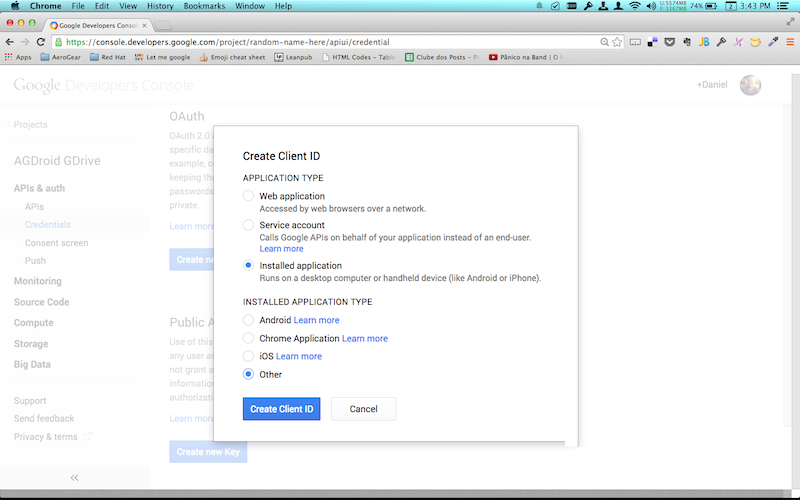
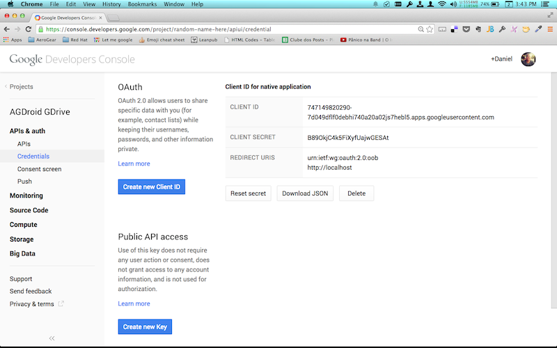

# AGDroid GDrive: Basic Mobile Application showing the AeroGear Authz (OAuth2) feature on Android
---------
Author: Daniel Passos (dpassos) & Summers Pittman (supittma)   
Level: Beginner  
Technologies: Java, Android  
Summary: A basic example of OAuth2 : Login and retrieve data.  
Target Product: -   
Product Versions: -   
Source: https://github.com/aerogear/aerogear-android-cookbook/tree/master/GDrive

## What is it?

The ```AGDroid GDrive``` project demonstrates how to include Authz/OAuth2 functionality in Android applications.

This simple project consists of a ready-to-build Android application. Before building the application, you must create an OAuth2 credential in Google's console. The credentials must then be inserted into the application source code. After this is complete, the application can be built and deployed to Android devices. 

When the application is deployed to an Android device, the application will ask for your Google credentials, ask permission to access your account and retrieve your documents.

## How do I run it?

### 0. System Requirements

* [Java 7](http://www.oracle.com/technetwork/java/javase/downloads/index.html)
* [Gradle 2.1](http://www.gradle.org/)
* Latest [Android SDK](https://developer.android.com/sdk/index.html) and [Platform version 19](http://developer.android.com/tools/revisions/platforms.html)

### 1. Google credentials

First, you must authenticate with Google. You will need a Google Account for this. Now open the [Google Console](http://console.developer.google.com).

If you haven't created a project, click "Create Project" and give the new project a name:


Now you need to enable the Drive API. To do that, navigate to APIs & auth > APIs and scroll down to the Drive API item, which you need to turn on:


Now you need create new credentials to access your Drive accounts from the app. Go to APIs & auth > Credentials and inside OAuth area click the blue `Create new Client ID` button. This launches the following popup, where you select `Installed application` and `Other`:



On the last screen finally get to see the actual value of the generated `client id`, `secret id` and `redirect uris`, which you will use later:



### 2. Customize and Build Application

The project source code must be customized with your Google credentials. 

1) Open ```/path/to/gdrive/src/org/jboss/aerogear/android/example/gdrive/Constants.java``` for editing.   

2) Enter the ```client id```, ```client secret``` and ```redirect url``` for the following constants:

```java
String AUTHZ_CLIENT_ID = "";
String AUTHZ_CLIENT_SECRET = "";
String AUTHZ_REDIRECT_URL = "";
```
3) Save the file.   

4) Build the application
```shell
$ cd /path/to/gdrive/
$ mvn compile
```

### 3. Test Application

To deploy, run and debug the application on an Android device attached to your system, on the command line enter the following:

```shell
$ cd /path/to/gdrive
$ mvn clean package android:deploy android:run
```

Application output is displayed in the command line window.

## How does it work?

```MainActivity``` is invoked. The Activity life cycle ```onStart``` is called first invoking the ```authz``` method — attempting to display a Google login screen.

```java
authzModule = AuthorizationManager.config("GoogleDriveAuthz", OAuth2AuthorizationConfiguration.class)
        .setBaseURL(new URL(AUTHZ_URL))
        .setAuthzEndpoint(AUTHZ_ENDPOINT)
        .setAccessTokenEndpoint(AUTHZ_TOKEN_ENDPOINT)
        .setAccountId(AUTHZ_ACCOUNT_ID)
        .setClientId(AUTHZ_CLIENT_ID)
        .setClientSecret(AUTHZ_CLIENT_SECRET)
        .setRedirectURL(AUTHZ_REDIRECT_URL)
        .setScopes(Arrays.asList("https://www.googleapis.com/auth/drive"))
        .setAdditionalAuthorizationParams(ImmutableSet.of(Pair.create("access_type", "offline")))
        .asModule();

authzModule.requestAccess(this, new Callback<String>() {
    @Override
    public void onSuccess(String o) {
        Log.d("TOKEN ++ ", o);
        retriveFiles();
    }

    @Override
    public void onFailure(Exception e) {
        Toast.makeText(getApplicationContext(), e.getMessage(), Toast.LENGTH_LONG).show();
    }
});
```
