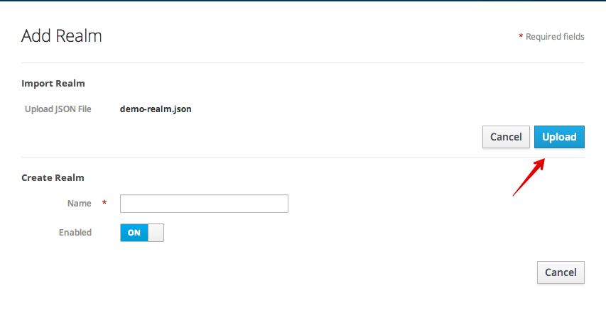
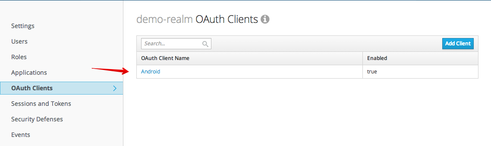
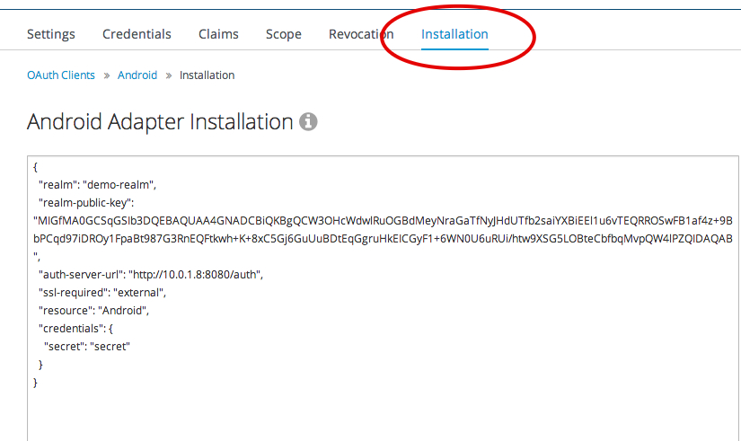

# Keycloak Authenticator Example

This is an implementation of AbstractAccountAuthenticator for Keycloak.

# Configure Keycloak

Before the demo Authenticator can be used a Keycloak installation must be configured.  If you do not have Keycloak, you can follow the directions [here](http://docs.jboss.org/keycloak/docs/1.0.4.Final/userguide/html/server-installation.html).

You will need to sign into Keycloak and import a new Realm. The configuration file `demo-realm.json` is located under `realm-config` folder.



After you upload `demo-realm.json` file, select OAuth Clients from the navigation and click on Android:



Go to 'Installation' menu and copy the json in the text field.



# Configure the Application

Create a file 'keycloak.json' in the res/raw directory.  Paste the Keycloak installation json into the file and save it.

Launch an emulator (or connect a device in debug mode) and run `./gradlew installDebug` from the command line.

Open the `Settings` App on Android and select `Add an account`.


Select `Keycloak Secured Account`


Log into a Keycloak account available to your realm.


Approve the Grant.

You Account is now added.


# What Now?

Any application which uses Android's Account Authenticator system can now use the Keycloak account you have created.  The follow snippet is all they need to include.

````
Account account = am.getAccountsByType("org.keycloak.Account")[0];
````

There is a [sample app](https://github.com/secondsun/keycloak-account-authenticator-demo) using Keycloak available as well.
