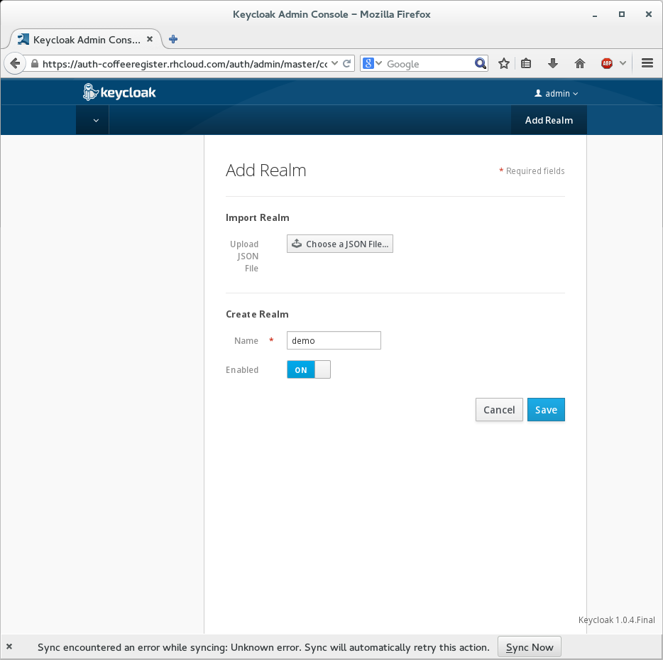
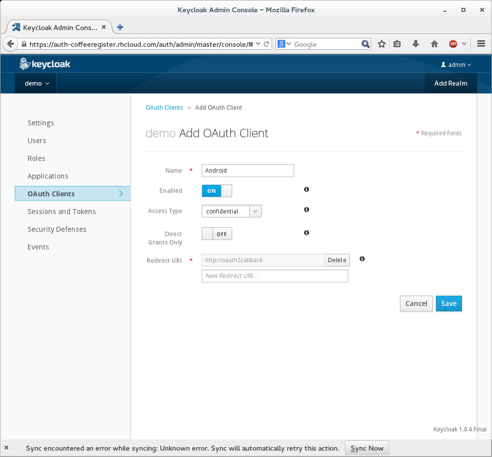
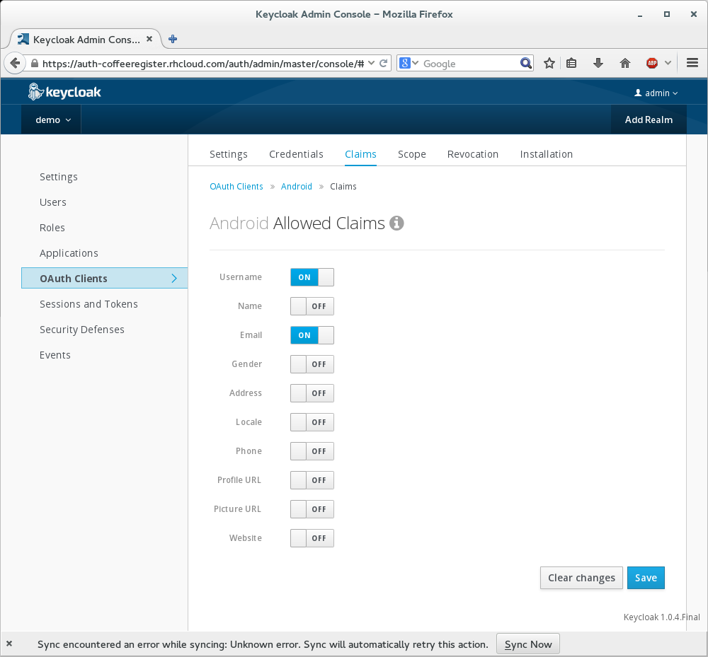
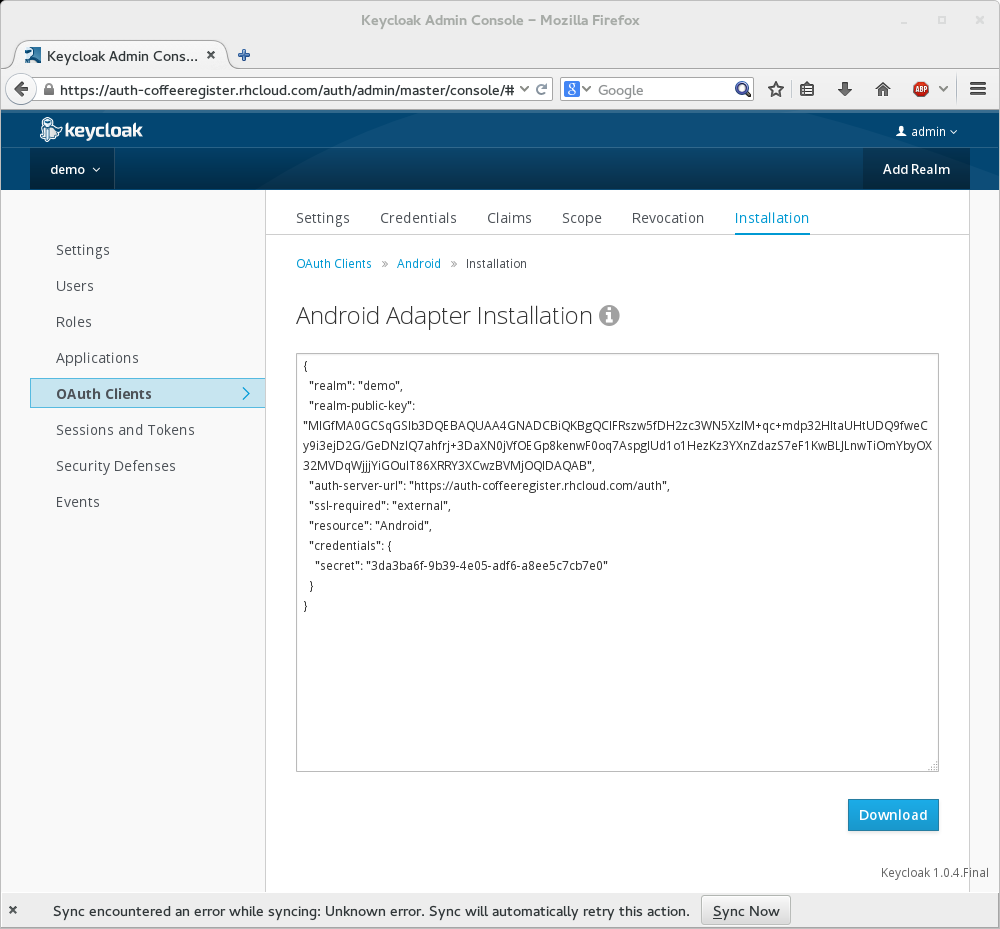
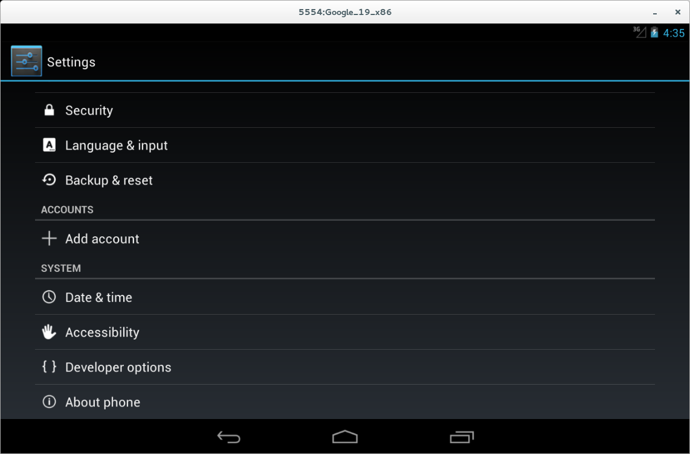
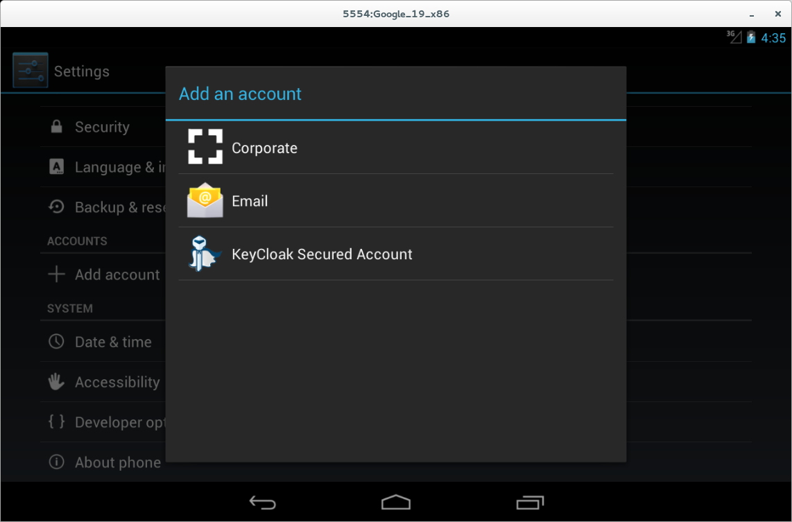
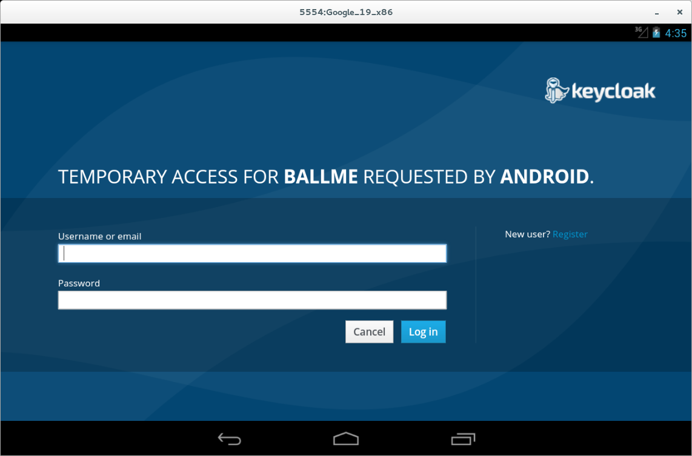
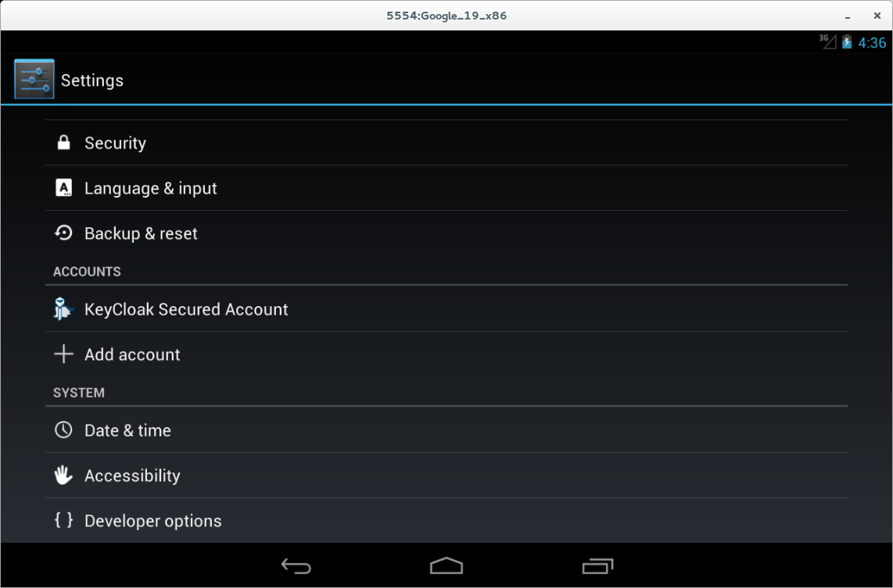

# KeyCloak Authenticator Example

This is an implementation of AbstractAccountAuthenticator for KeyCloak.  

# Configure KeyCloak

Before the demo Authenticator can be used a KeyCloak installation must be configured.  If you do not have KeyCloak, you can follow the directions [here](http://docs.jboss.org/keycloak/docs/1.0.4.Final/userguide/html/server-installation.html).

 You will need to sign into KeyCloak and add a new Realm.

 

 After you create the realms, add a OAuth Client.  Use `http://oauth2callback` as the Redirect URI.

 

After the Client is created, select Claims from the navigation and enable Username.



Finally, select 'Installation' from the navigation and copy the json in the text field.



# Configure the Application

Create a file 'keycloak.json' in the res/raw directory.  Paste the KeyCloak installation json into the file and save it.

Launch an emulator (or connect a device in debug mode) and run `./gradlew installDebug` from the command line.

Open the `Settings` App on Android and select `Add an account`.



Select `KeyCloak Secured Account`



Log into a KeyCloak account available to your realm.



Approve the Grant.

You Account is now added.



# What Now?

Any application which uses Android's Account Authenticator system can now use the KeyCloak account you have created.  The follow snippet is all they need to include.

````
Account account = am.getAccountsByType("org.keycloak.Account")[0];
````

There is a [sample app](https://github.com/secondsun/keycloak-account-authenticator-demo) using KeyCloak available as well.